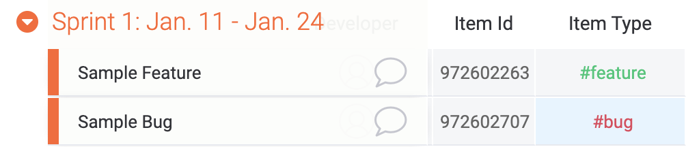
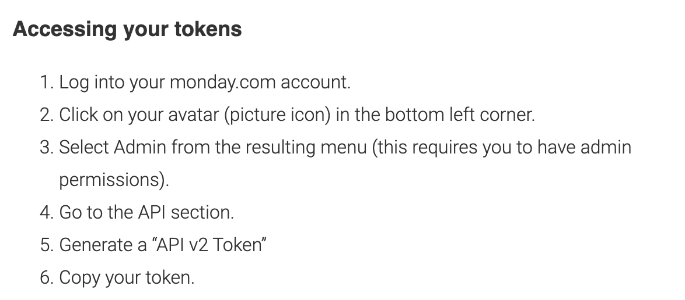
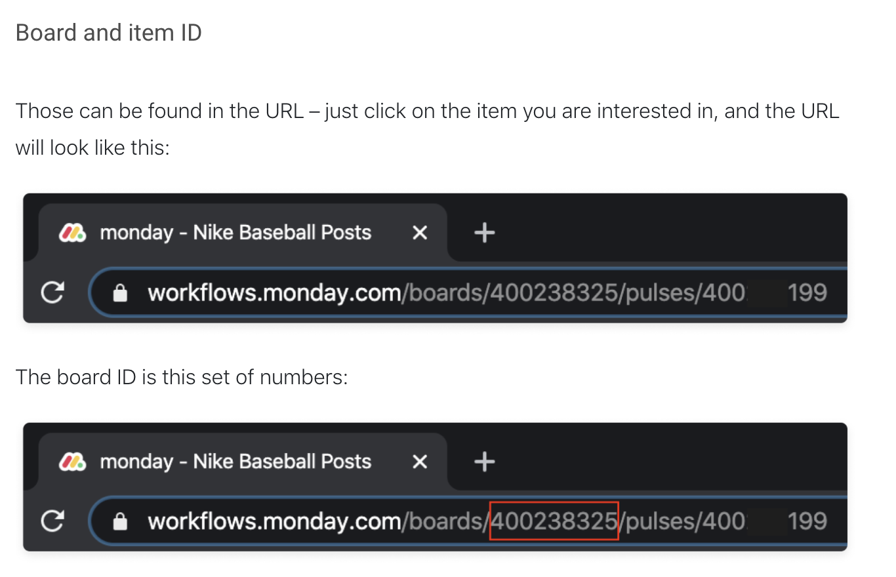
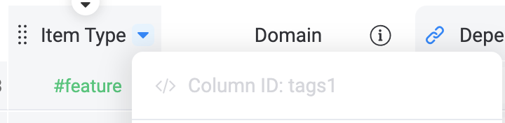
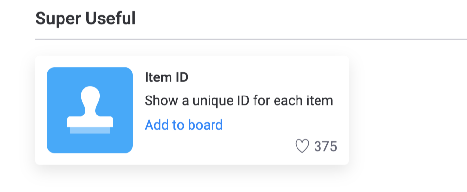
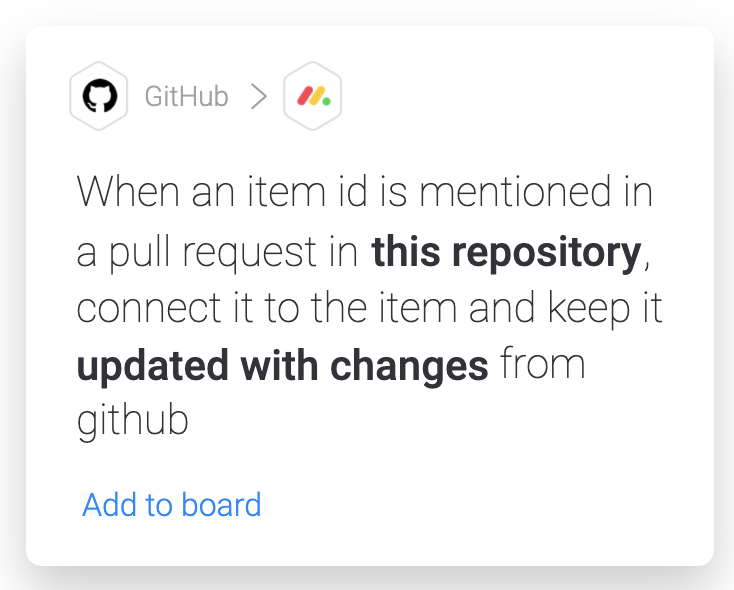

# Introduction

Welcome to `git-monday-cli`!

This package provides a CLI with two commands that aid in development workflow using Monday, Git, and Github.

### _Gitmon Start_

```
gitmon start {Monday Issue Id} {Optional branch tag}
```

`gitmon start` will create a new local git branch with a name based off the Monday item tag (or any tag column you specify), the item id (see how to find the Monday item id [here](#required-monday-item-id-column)), and an optional branch tag.

For example, with the following Monday items:

If you write

```
gitmon start 972602263 "Sample Feature"
```

the CLI will create a new local branch named `feature/972602263-Sample_Feature` (if you left out "Sample Feature" it will just be `feature/972602263`). I chose not to grab and append the item name automatically because item names can get long.

If you write

```
gitmon start 972602707
```

the CLI will create a new local branch named `bug/972602707`. This assumes that you have set an environment variable named `MONDAY_ITEM_TYPE_COLUMN_ID` to be the column ID of the "Item Type" column in Monday (more on that in [Setup](#setup)). If you don't have that variable set, all created branches will be prefixed with "feature" by default.

If you set the `MONDAY_STATUS_COLUMN_ID` environment variable, it will change the status of the corresponding Monday item to "Working on it" to let your team know that you are starting work on that task/item/feature/bug.

### _Gitmon PR_

```
gitmon pr
```

`gitmon pr` will automatically push the current local branch to the remote origin and create a pull-request in Github. The pull-request's title will be the name of the Monday item, and the body will be "Monday ID: `#{Monday Item Id}`". If you have enabled the [Recommended Monday Integration](#recommended-monday-integrations), this will create a link betwen the Monday item and the Github PR.

If you set the `MONDAY_STATUS_COLUMN_ID` environment variable, it will change the status of the corresponding Monday item to "In Review" to let your team know that the task is ready for review by other developers.

TODO: add a command line option to tag a reviewer and potentially update a column and/or create a new item for that reviewer in Monday

# Installation

`npm install -g git-monday-cli`

# Setup

This package will only work in an existing local `git` repository that has a remote origin. It is simply a thin layer on top of [git](https://git-scm.com/) and [gh](https://github.com/cli/cli) commands that makes use of Monday's API.

In order to connect to Monday's API and grab information about an item from a board, you will need to create a `.env` file in the repository in which you plan to use the CLI.

The following two variables are required:

- MONDAY_TOKEN

  From Monday's [API Documentation](https://monday.com/developers/v2#authentication-section):
  

- MONDAY_BOARD_ID
  From this [support post](https://support.monday.com/hc/en-us/articles/360000225709-Where-to-find-board-item-and-column-IDs):
  

The following two variables are optional:

- MONDAY_STATUS_COLUMN_ID: the status column that you would like to be updated when you use `gitmon start` and `gitmon pr`.

- MONDAY_ITEM_TYPE_COLUMN_ID: the tag column that you would like to grab for the branch prefix (before the '/') when using `gitmon start` -> if not implemented, it will default to using 'feature' as the prefix

In order to be able to see your column's ids, you need to enable developer mode. Check out [this video from Monday](https://monday.com/developers/v2#introduction-section-how-to-get-started-developer-mode) for how to do that. Once you've enabled developer mode, you should be able to click any column header and see its id like so:


Once you've tracked down all that information your `.env` should look like this:

```
MONDAY_TOKEN={Your Monday Token}
MONDAY_BOARD_ID={Your Sprint Board Id}
MONDAY_STATUS_COLUMN_ID={Your Status Column Id}
MONDAY_ITEM_TYPE_COLUMN_ID={Your Item Type Id}
```

# Required Monday Item ID Column

The ID for a Monday item appears in the URL when you select an item, but the easiest way to view and copy item ids is by adding the Item ID column. Simply add a new column and go to the column center and search for "Item Id". You should see the following:


Clicking this should give your board a new column called "Item ID". Clicking the value in this column for any item should automatically copy the Id to your clipboard for easy use with the `gitmon start` command.

# Recommended Monday Integration

In order to have your Github PR automatically connected to the corresponding Monday item, I recommend adding the following integration to your Monday board:



Check out this Monday support article on setting up github integrations: https://support.monday.com/hc/en-us/articles/360002354759-GitHub-Integration

If you've set up this integration properly, you should see a new column added to your board called "Github PR" with the official github logo.
